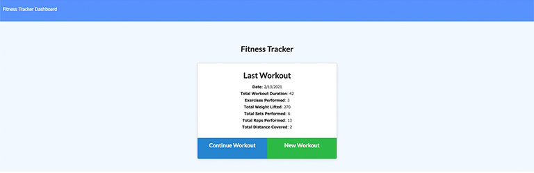

# [8bit-workout-tracker](https://sleepy-bastion-93010.herokuapp.com/)

    
    
    
    

    
    

## Application Demo

To watch a video of the application being fully demo'd please use this link: [Application Demo](https://drive.google.com/file/d/1GMyKp0tC8Ostbyeoxpj9ye-HPdbf3n2Q/view).

## Workflow

When I first saw this homework assignment, I had some grand ideas of creating these cool 8-bit (hence the name on Github) graphics to represent each workout. Then I saw that the front end was supplised. I was a bit disappointed but figured that I could still do some design changes. Then I got sick. So, I decided to do what I could with what little energy I had.

At the start of the project, I wanted to hard code the front end. We were given files in our Develop folder but I wanted to better understand them. Our substitute teacher earlier this year had said to hard code things until they clicked. So, I decided to go that route. It really helped me better understand how things were connected. However, there were issues where I had mistyped things. Considering I had already hard coded the front end, I decided to copy and paste from the develop files rather than try to find the few mistakes.

During class, our instructor did some demos of what we needed to put into the back end to connect things. This was a lot of fun cause it was like re-solving a puzzle that you had already completed but with different shapes. After those demos, I met with a few guys (listed below) from my study group for about 2 hours to go through each other's code. We were all having issues in various spots of our code. Between the three of us, we were able to piece together the code to get it to work.

The last thing to do was deploy to Heroku. I've been pretty good at deploying there but I am often nervous when we try new ways to deploy on Heroku. Some class mates were talking in Slack about issues they had deploying. So, I made sure to read those before I deployed to be ready for any issues. I learned from one of them that sometimes it takes a while for Heroku to deploy the database, so I didn't panic when mine wasn't connecting. I ended up following the advice of a classmate who had changed his Admin password to get his Heroku app to deploy. Worked like a charm. Unsure why my previous admin password didn't work.

## Technologies Used

  
  
  
  
  
  
  
  
  

## Resources

[Shields.io](https://shields.io/)

[Font Awesome](https://fontawesome.com/)

[Screencastify](https://www.screencastify.com/)

### My Study Group

- [Ian](https://github.com/Ianaac27)
- [Thomas](https://github.com/Tskading)
